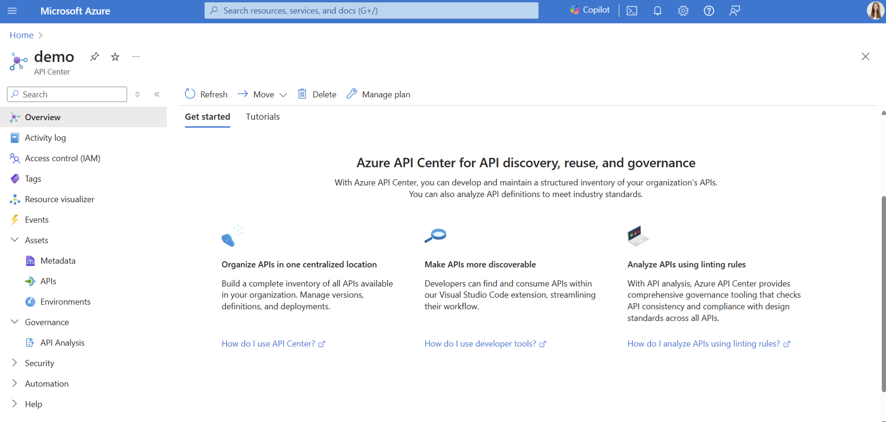
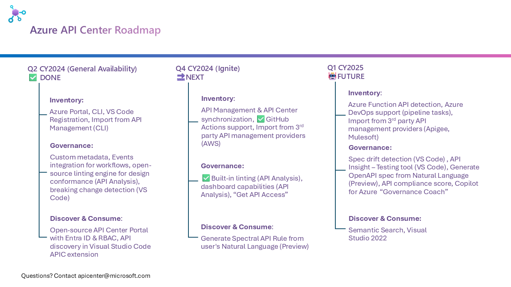

# Azure API Center

In today’s API-first digital ecosystem, organizations are challenged with an ever-expanding network of APIs. This proliferation - known as API sprawl - poses significant challenges in API governance, security, compliance, and reuse. Without a centralized inventory, APIs can become isolated, leading to poor API reuse, lack of alignment with organizational API design and organizational processes, as well as increased vulnerability to security breaches.

## Content Overview

- :bulb: [What is Azure API Center?](#azure-api-center)
- :arrow_forward: [Getting Started Resources](#getting-started-resources)
- :dart: [Roadmap](#roadmap)
- :warning: [How to provide feedback](#how-to-provide-feedback)
- :bookmark_tabs: [Other resources](#other-resources)

## What is Azure API Center?

**Azure API Center** provides a centralized API inventory for seamless API discovery, reuse, and governance regardless of API type, lifecycle stage, or deployment location. Azure API Center addresses a critical need for centralized API inventory, ensuring that the extraordinary growth of APIs enhances rather than hinders the development process:

- **Build a complete and current catalog of all APIs** - regardless of their type, stage in their lifecycle, or deployment location - to enable API discovery, consumption, and governance.

- Enable API best practices at-scale and **enforce API design rules** across your organization to empower API developers to create APIs in line with these standards, ensuring quality and uniformity across all APIs produced.

- **Foster reusability** of your APIs by enabling API consumers to quickly discover and consume the right APIs.

- **Improve API producer and consumer developer experience** with our Visual Studio Code extension.

[Learn more about API Center](https://aka.ms/apicenter/blogpost)

## Getting Started Resources

What is Azure API Center?
- Video: [Exploring Azure API Center: From VS Code to the Azure Portal](https://youtu.be/w9Sr7adTPPI?si=s-vWG5VBKETuxD5X)

Build a Complete & Current API Inventory:
- Quickstart: [Create your API center](https://learn.microsoft.com/azure/api-center/set-up-api-center)
- Video: [Automate API Registration with GitHub Actions in Azure API Center](https://youtu.be/DviYjNVJ-cw?si=h0EBUWEh3uuMDgOL)
- Video: [How to Import APIs from Azure API Management to Azure API Center using CLI](https://youtu.be/SuGkhuBUV5k?si=M0VrEjnq4K6qBBSz)
- Tutorial: [Register APIs in your API inventory](https://learn.microsoft.com/azure/api-center/register-apis)

API Governance - Design time governance:
- Video: [Mastering API Governance with Azure API Center](https://youtu.be/m0XATQaVhxA?si=oDfFDPE9hDPbrczP)
- Tutorial: [Enable linting and analysis for API governance in your API center](https://learn.microsoft.com/azure/api-center/enable-api-analysis-linting)

API Discovery & Consumption - Get started with our VS Code extension:
- Video: [Introducing the VS Code extension for Azure API Center](https://youtu.be/62X0NALedCc) 
- Documentation: [Get started with the Azure API Center extension for Visual Studio Code](https://learn.microsoft.com/azure/api-center/use-vscode-extension)

Elevating API Discovery with a self-hosted API Center Portal:
- Documentation [Self-host your API Center portal](https://learn.microsoft.com/azure/api-center/enable-api-center-portal)
- GitHub Repo [APICenter Portal Starter](https://github.com/Azure/APICenter-Portal-Starter)

GitHub Example Repos: 
- GitHub Repo: [API Center ❤️ all APIs](https://github.com/Azure-Samples/universal-api-center)

## Roadmap

> :memo: **Note**: Please note that this roadmap is a living document and may be updated as priorities shift and new information becomes available. We appreciate your understanding and flexibility as we strive to deliver the best possible outcomes

## Now
- <ins>**Inventory**</ins>
    - [x] **GitHub Actions support**: Released.
    - [x] **APIM / APIC Sync**: Gated Preview.
    - [ ] **Import from AWS**: Research phase.
    - [ ] **Multiple spec support**: Research phase.
- <u>**Governance**</u>
    - [x] **Managed API Anlayis**: Public Preview.
    - [x] **API Anlayis Dashboard**: Public Preview.
    - [ ] **Increase linting limit for Standard**: In development.
    - [ ] **Execution History - API details**: In development.
    - [ ] **VS Code - compliant openapi spec generation**: In development.
    - [ ] **VS Code - Copilot for Azure integration**: In development.
- <u>**Discover & Consume**</u>
    - [ ] **From APIC deployment to APIM**: Research phase.
    - [ ] **API Center Portal hosting support evaluation**: Research phase.

## Next
- <u>**Inventory**</u>
    - [ ] Multiple spec support
    - [ ] Azure Functions integration
    - [ ] Import from Apigee
- **Governance**
    - [ ] Enable search and filtering API Analysis
    - [ ] Managed Linting - AsyncAPI support
    - [ ] Download API Analysis Report
- **Discover & Consume**
    - [ ] API's visibility concept via data plane
    - [ ] Filtering and searching based on metadata in APIC Portal
    - [ ] API Center Portal Starter-Kit improvements - one-click deployment

## Later
- **Inventory**
    - [ ] **App Service integration**
    - [ ] **Source control: GitHub repository integration**
- **Governance**
    - [ ] **Managed linting - API governance profiles**
    - [ ] **Missing metadata dashboard**
    - [ ] **Missing API spec dashboard**
    - [ ] **API health check**
    - [ ] **Breaking change detection**
- **Discover & Consume**
    - [ ] **Get API Access**
    - [ ] **Semantic search**
    - [ ] **Backstage plugin**

## How to provide feedback

Your feedback is invaluable to us, and we encourage you to share your thoughts and suggestions in the repository's **Issues** section. *Note: Please search for existing issues to see if your feedback or bug report has already been submitted.* 

We’ll be keeping a close eye on your input to continuously improve. While we’re dedicated to monitoring these issues, please note that this channel is not part of our Microsoft Azure Service Support.

If you prefer to keep the communication private, you can contact the API Center product team directly at apicenter@microsoft.com.

## Other resources

* [Contribution guidelines and policy](CONTRIBUTIONS.md)
* [Security policy](SECURITY.md)
* [Code of conduct policy](CODE_OF_CONDUCT.md)
